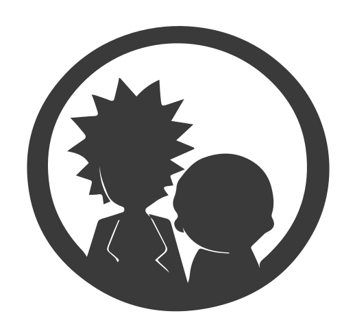

<h1 align="start">
  
  Rick and Morty 
</h1>

Uma aplicação web para explorar os personagens do Rick and Morty, utilizando a [Rick and Morty API](https://rickandmortyapi.com/).

## Tecnologias Utilizadas

